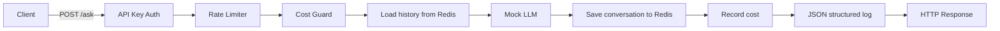
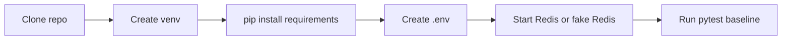
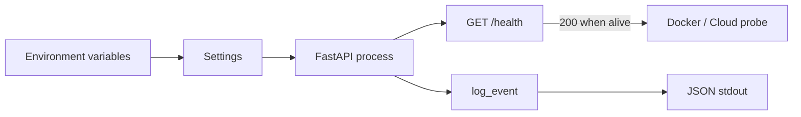
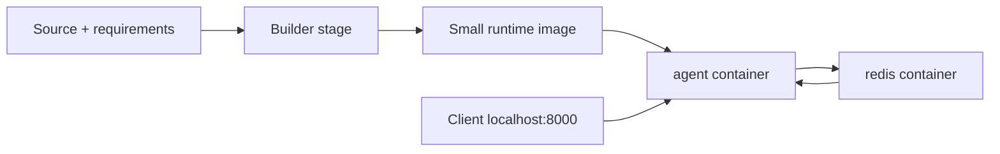
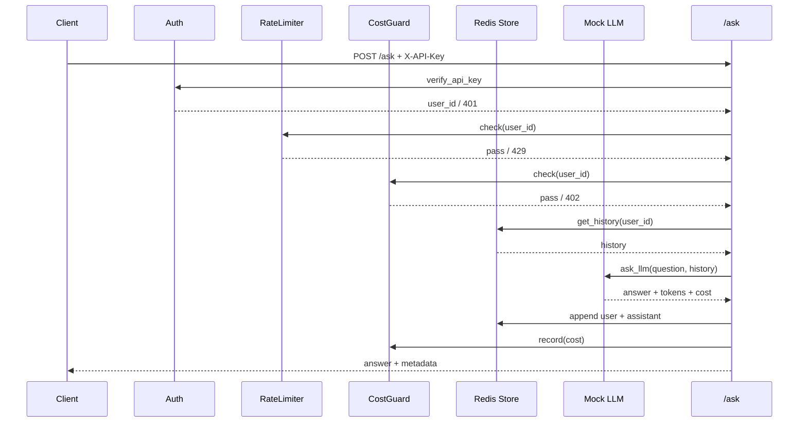
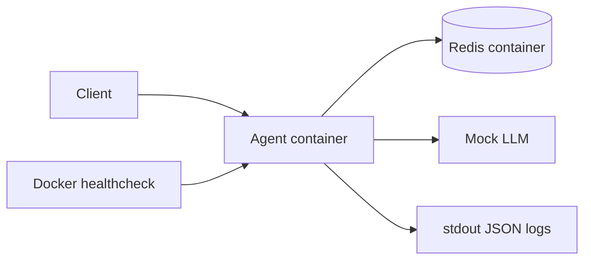
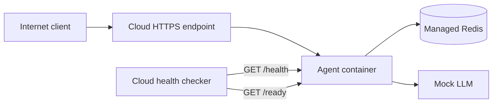
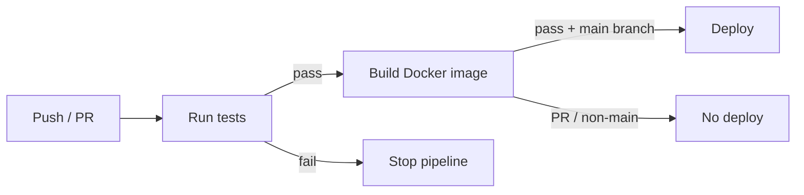

# Reconnaissance — DAY12-2A202601775-NguyenTuanAnh

> Repository: `ngtanh1112/DAY12-2A202601775-NguyenTuanAnh`  
> Nhánh kiểm tra: `main`  
> Mục tiêu của tài liệu này: hiểu project đang làm gì, repo hiện ở trạng thái nào, và cần làm gì theo đúng thứ tự dependency để hoàn thành.  
> **Không có file code nào trong repository bị sửa trong quá trình reconnaissance này.**

---

# 1. PROJECT NÀY LÀ GÌ?

## 1.1 Sản phẩm cuối cùng

Đây là một bài lab xây dựng và đưa một **AI agent dạng HTTP API** từ môi trường local lên cloud theo hướng production-ready.

Sản phẩm cuối cùng không phải frontend/web UI. Nó là một **FastAPI service** có các endpoint chính:

- `GET /health`: liveness probe, cho biết process còn hoạt động hay đang shutdown.
- `GET /ready`: readiness probe, cho biết instance có sẵn sàng nhận traffic và kết nối Redis được hay không.
- `POST /ask`: endpoint chính để người dùng gửi câu hỏi tới agent.

Agent trong bài lab **không gọi OpenAI thật**. Repo đã cho sẵn `utils/mock_llm.py`, là mock LLM trả lời tất định, tính token và chi phí giả lập. Mục đích của bài là học hạ tầng, bảo mật, state, container và deployment chứ không phải xây model AI.

## 1.2 Người dùng sử dụng nó như thế nào?

Người dùng/client gọi API qua HTTP.

Ví dụ luồng sử dụng mong muốn:

1. Client gửi `POST /ask`.
2. Request phải có `X-API-Key` hợp lệ.
3. Service xác định `user_id` từ `X-User-Id` hoặc dùng `anonymous`.
4. Kiểm tra rate limit.
5. Kiểm tra ngân sách theo tháng.
6. Lấy lịch sử hội thoại của user từ Redis.
7. Gọi mock LLM.
8. Lưu câu hỏi và câu trả lời trở lại Redis.
9. Ghi nhận chi phí.
10. Ghi structured log.
11. Trả response gồm answer, user_id, history_length, cost và token usage.



## 1.3 Các chức năng chính mà project hướng tới

### Cấu hình production theo 12-Factor

`app/config.py` phải đọc cấu hình từ biến môi trường, đặc biệt `AGENT_API_KEY` không có default để fail fast khi thiếu secret.

### Structured logging

`app/logging_utils.py` phải xuất mỗi event dưới dạng một JSON object trên đúng một dòng stdout.

### Health / readiness probes

- `/health`: không phụ thuộc Redis hay dependency bên ngoài.
- `/ready`: kiểm tra Redis và trạng thái shutdown.

### API authentication

`app/auth.py` xác thực `X-API-Key`, dùng `secrets.compare_digest`.

### Rate limiting

`app/rate_limiter.py` dùng Redis Sorted Set và sliding window 60 giây, giới hạn riêng theo user.

### Cost guard

`app/cost_guard.py` lưu tổng chi phí theo `user + tháng` trong Redis và chặn khi vượt ngân sách.

### Conversation state trên Redis

`app/store.py` lưu lịch sử hội thoại bên ngoài process để nhiều instance cùng nhìn thấy state.

### Graceful shutdown

`app/lifecycle.py` xử lý `SIGTERM` / `SIGINT`, đánh dấu `shutting_down` và nhường lại handler cũ của uvicorn.

### Containerization

Dockerfile phải trở thành multi-stage, dùng image nhỏ, non-root user, healthcheck và đọc `PORT` từ environment.

Docker Compose phải chạy ít nhất:

```text
agent + redis
```

### Cloud deployment

Repo hỗ trợ cấu hình Railway hoặc Render. Sau deploy phải có HTTPS public URL thật và ghi vào `DEPLOYMENT.md`.

### Test-driven checkpoints

Project được chia thành CP1 → CP5, mỗi checkpoint có file test riêng. `grade.py` chấm tự động theo số test pass.

---

# 2. TRẠNG THÁI HIỆN TẠI

## Kết luận tổng quát

Repo hiện tại **gần như vẫn ở trạng thái template bài lab trước khi học viên bắt đầu implement**.

Bằng chứng mạnh nhất là các module cần làm ở CP1, CP3 và CP4 vẫn còn `TODO` và trực tiếp `raise NotImplementedError(...)`. Dockerfile và Compose cũng vẫn là phiên bản mẫu cố ý chưa production-ready. `DEPLOYMENT.md` chưa được điền URL thật.

Lịch sử commit hiện có chủ yếu là commit tạo lab, thêm bonus CI/CD và chỉnh README/LAB_GUIDE; chưa thấy commit triển khai các checkpoint của bài làm.

## 2.1 ĐÃ CÓ

### Khung FastAPI và wiring dependency

`app/main.py` đã có:

- FastAPI app.
- `AskRequest` với validation `question` dài 1–2000 ký tự.
- provider cho `ConversationStore`, `RateLimiter`, `CostGuard`.
- lifespan hook.
- route skeleton `/health`, `/ready`, `/ask`.
- entry point chạy uvicorn.

Tức là kiến trúc tổng đã được dựng, nhưng logic route chưa hoàn thiện.

### Mock LLM hoàn chỉnh

`utils/mock_llm.py` đã có implementation dùng được:

- nhận question và history;
- tạo answer tất định;
- ước lượng input/output tokens;
- tính `cost_usd` giả lập;
- trả dict kết quả.

File này được ghi rõ là cho sẵn và không cần sửa.

### Redis client factory cơ bản

`app/store.py` đã có `get_redis_client()`:

- hỗ trợ Redis thật qua URL;
- hỗ trợ `fake://` bằng fakeredis;
- dùng `decode_responses=True`.

Phần CRUD lịch sử vẫn chưa implement.

### Hạ tầng test và chấm điểm

Đã có đầy đủ:

- `tests/test_cp1.py`
- `tests/test_cp2.py`
- `tests/test_cp3.py`
- `tests/test_cp4.py`
- `tests/test_cp5.py`
- `tests/test_bonus_cicd.py`
- `grade.py`

Đây là specification executable khá rõ. Trong repo này, test chính là nguồn sự thật quan trọng để xác định “done”.

### Redis service trong Docker Compose

`docker-compose.yml` đã có service `redis` với:

- `redis:7-alpine`;
- append-only persistence;
- volume;
- healthcheck.

### Cloud config mẫu

Đã có:

- `railway.toml`
- `render.yaml`

Cả hai đều đã thể hiện ý định deploy bằng Docker và healthcheck `/health`.

### Environment template

`.env.example` đã có các biến:

- `PORT`
- `AGENT_API_KEY`
- `REDIS_URL`
- `RATE_LIMIT_PER_MINUTE`
- `MONTHLY_BUDGET_USD`
- `LOG_LEVEL`
- `LOCAL_FALLBACK`
- `DEPLOY_API_KEY`

### Tài liệu lab

`README.md`, `LAB_GUIDE.md`, `DEPLOYMENT.md`, `exercises.md` đã có template/hướng dẫn rất chi tiết.

---

## 2.2 ĐANG DỞ

Các phần dưới đây đã có file, interface và test, nhưng implementation chưa hoàn chỉnh.

### CP1 — Config

`app/config.py` có class `Settings`, nhưng **chưa khai báo 6 field** yêu cầu.

Hiện trạng:

```text
TODO CP1
- port
- agent_api_key
- redis_url
- rate_limit_per_minute
- monthly_budget_usd
- log_level
```

### CP1 — Structured logging

`app/logging_utils.py` có `utc_now_iso()`, nhưng `log_event()` vẫn:

```python
raise NotImplementedError(...)
```

### CP1 / CP4 — `/health`

Route đã tồn tại nhưng body vẫn `NotImplementedError`.

### CP3 — Authentication

`app/auth.py` có signature và constants, nhưng `verify_api_key()` chưa implement.

### CP3 — Rate limiting

`app/rate_limiter.py` có class, key convention và constants, nhưng:

- `hit_count()` chưa implement;
- `check()` chưa implement.

### CP3 — Cost guard

`app/cost_guard.py` có key format, month helper và TTL constant, nhưng:

- `spent()` chưa implement;
- `check()` chưa implement;
- `record()` chưa implement.

### CP4 — Conversation store

`app/store.py` có Redis client factory và `clear()`, nhưng:

- `ping()` chưa implement;
- `append()` chưa implement;
- `get_history()` chưa implement.

### CP4 — Graceful shutdown

`app/lifecycle.py` có state và class skeleton, nhưng:

- `request_shutdown()` chưa implement;
- `install()` chưa implement.

### CP4 — `/ready`

Route đã tồn tại nhưng body vẫn `NotImplementedError`.

### CP3 / CP4 — `/ask`

Endpoint đã có dependency injection và mô tả chính xác thứ tự xử lý, nhưng implementation vẫn chưa có.

### CP2 — Dockerfile

Dockerfile hiện tại **chạy được ở mức cơ bản nhưng cố ý chưa production-ready**:

- chỉ một stage;
- dùng `python:3.11` đầy đủ;
- `COPY . .` trước `pip install`;
- chạy root;
- không `HEALTHCHECK`;
- hardcode port `8000` trong CMD.

### CP2 — `.dockerignore`

Hiện mới có:

- `.git`
- `.gitignore`

Còn thiếu các mục test yêu cầu như `.env`, `__pycache__`, `.venv`.

### CP2 — Docker Compose

Có Redis nhưng chưa có service `agent`.

---

## 2.3 CHƯA CÓ / CHƯA HOÀN THÀNH

### CP5 — Deployment thực tế

`DEPLOYMENT.md` vẫn chứa placeholder:

- họ tên;
- mã học viên;
- link repo;
- Public URL dạng `https://TODO-thay-bang-url-that...`;
- platform;
- ngày deploy;
- output kiểm tra;
- screenshot.

Vì vậy chưa có bằng chứng service đã được deploy công khai.

### Bài phản ánh `exercises.md`

Cả 10 câu vẫn còn placeholder `> *Câu trả lời của bạn*`.

Theo `grade.py`, phần này tương ứng 15 điểm bắt buộc.

### Bonus CI/CD

README mô tả `.github/workflows/` là phần phải tự tạo. Test bonus yêu cầu workflow YAML thực tế, nhưng repository reconnaissance chưa có bằng chứng một workflow đã được implement và chạy passing.

Bonus này không phải dependency để hoàn thành phần bắt buộc CP1–CP5.

---

# 3. ROADMAP TUẦN TỰ

Roadmap dưới đây bám theo dependency thật trong code và test. Không nên nhảy thẳng tới cloud khi `/health`, `/ask`, Redis state và Docker còn chưa chạy. Cloud không có năng lực chữa code bằng phép màu, dù dashboard thường cố tạo ấn tượng như vậy.

---

## Bước 0 — Setup môi trường và lấy baseline

### Mục tiêu

Đảm bảo repo chạy được test suite và local environment trước khi sửa logic.

### Hiện trạng

Repo đã có:

- `requirements.txt`;
- `.env.example`;
- Docker Compose service Redis;
- pytest checkpoints;
- `grade.py`.

README/LAB_GUIDE xác nhận checkpoint đầu chỉ cần pytest chạy được, việc test đỏ ở trạng thái ban đầu là bình thường.

### Cần làm

Sau khi bắt đầu implementation thực tế:

1. Tạo virtual environment.
2. Cài dependency.
3. Copy `.env.example` → `.env`.
4. Sinh `AGENT_API_KEY` riêng.
5. Bật Redis hoặc tạm dùng `REDIS_URL=fake://`.
6. Chạy test baseline.

File/module liên quan:

- `requirements.txt`
- `.env.example`
- `docker-compose.yml`
- `tests/`

### Luồng hoạt động



### Dependency

Không phụ thuộc bước implementation nào.

Tất cả CP1–CP5 phía sau đều phụ thuộc môi trường này hoạt động.

### Kết quả

Có môi trường dev ổn định và biết chính xác test nào đang fail trước khi code.

### Kiểm tra

```powershell
pytest tests/ -v -m "not docker"
```

Không yêu cầu xanh. Chỉ yêu cầu pytest import/chạy được mà không lỗi môi trường kiểu `ModuleNotFoundError`.

---

## Bước 1 — Hoàn thành CP1: Config, logging và liveness

### Mục tiêu

Biến skeleton FastAPI thành một process có thể khởi động đúng cấu hình production cơ bản, log được và trả health check.

### Hiện trạng

- `app/config.py`: có Settings skeleton, thiếu field.
- `app/logging_utils.py`: có timestamp helper, thiếu `log_event()`.
- `app/main.py`: `/health` đã khai báo nhưng chưa implement.
- `tests/test_cp1.py`: specification đầy đủ.

### Cần làm

#### `app/config.py`

Implement 6 settings:

- `port: int = 8000`
- `agent_api_key: str` không default
- `redis_url: str = "redis://localhost:6379/0"`
- `rate_limit_per_minute: int = 10`
- `monthly_budget_usd: float = 10.0`
- `log_level: str = "INFO"`

#### `app/logging_utils.py`

Implement `log_event()`:

- tạo dict `event`, `level`, `timestamp`;
- merge `fields`;
- `json.dumps(..., ensure_ascii=False)`;
- in đúng một dòng ra stdout;
- trả lại chuỗi JSON.

#### `app/main.py`

Implement `/health`:

- bình thường trả `{status: ok, service, version}`;
- không phụ thuộc Redis;
- đồng thời chuẩn bị behavior CP4: khi `lifecycle.shutting_down=True` thì 503.

### Luồng hoạt động



### Dependency

Phụ thuộc Bước 0.

Bước 2 Docker, Bước 3 API security và deploy phía sau đều cần Settings hoạt động.

### Kết quả

- App đọc config từ environment.
- Thiếu API key thì fail fast.
- Có structured log.
- `/health` hoạt động độc lập với Redis.

### Kiểm tra

```powershell
pytest tests/test_cp1.py -v
uvicorn app.main:app --reload --port 8000
curl http://localhost:8000/health
```

Mục tiêu: toàn bộ CP1 xanh.

---

## Bước 2 — Hoàn thành CP2: Docker production-ready và local stack

### Mục tiêu

Đóng gói app thành image có thể chạy giống nhau ở local và cloud, sau đó ghép app + Redis thành stack Docker Compose.

### Hiện trạng

- Dockerfile có bản single-stage chưa production-ready.
- `.dockerignore` thiếu nhiều mục.
- Compose đã có Redis nhưng chưa có agent.
- `tests/test_cp2.py` mô tả toàn bộ tiêu chí.

### Cần làm

#### `Dockerfile`

- chuyển thành multi-stage;
- dùng `python:3.11-slim` hoặc tương đương;
- copy `requirements.txt` và install dependency trước source;
- runtime stage chỉ mang dependency cần thiết;
- tạo non-root user;
- thêm `HEALTHCHECK` gọi `/health`;
- bind `0.0.0.0`;
- dùng `${PORT:-8000}` thay vì hardcode.

#### `.dockerignore`

Bổ sung tối thiểu:

- `.env`
- `__pycache__`
- `.git`
- `.venv`

Không ignore nhầm `app`, `utils`, `requirements.txt`.

#### `docker-compose.yml`

Thêm service `agent`:

- `build: .`;
- publish `8000:8000`;
- `AGENT_API_KEY: ${AGENT_API_KEY}`;
- `REDIS_URL: redis://redis:6379/0`;
- `depends_on: redis`;
- healthcheck.

### Luồng hoạt động



### Dependency

Phụ thuộc Bước 1 vì Docker healthcheck gọi `/health`, và container startup cần Settings đúng.

CP5 deploy phụ thuộc trực tiếp bước này.

### Kết quả

Project có một artifact deployable là Docker image, và local stack `agent + redis` chạy được bằng Compose.

### Kiểm tra

```powershell
pytest tests/test_cp2.py -v

docker build -t day12-agent:prod .
docker images day12-agent:prod

docker compose up -d
docker compose ps
curl http://localhost:8000/health
```

Mục tiêu:

- CP2 xanh;
- image < 500 MB theo test;
- agent container không chạy root;
- compose stack healthy.

---

## Bước 3 — Hoàn thành CP3: Authentication, rate limit, cost guard và `/ask`

### Mục tiêu

Biến `/ask` thành endpoint có thể dùng thật mà không để bất kỳ client nào gọi vô hạn hoặc tiêu ngân sách tùy ý.

### Hiện trạng

- API endpoint và dependency injection đã có.
- `verify_api_key`, `RateLimiter`, `CostGuard` đều mới là skeleton.
- `/ask` vẫn chưa implement.
- mock LLM đã hoàn chỉnh.

### Cần làm

#### `app/auth.py`

- lấy `agent_api_key` từ Settings;
- thiếu/sai key → 401;
- dùng `secrets.compare_digest`;
- trả `X-User-Id` hoặc `anonymous`.

#### `app/rate_limiter.py`

Implement sliding window bằng Redis ZSET:

1. xóa entry cũ hơn 60 giây;
2. đếm entry còn lại;
3. nếu đạt limit → 429 + `Retry-After`;
4. nếu chưa → thêm request hiện tại với member unique;
5. đặt TTL.

#### `app/cost_guard.py`

- `spent()` đọc tổng theo key `cost:user:YYYY-MM`;
- `check()` chặn 402 khi vượt budget;
- `record()` cộng chi phí và đặt TTL.

#### `app/main.py` — `/ask`

Implement đúng thứ tự đã ghi ngay trong docstring:

1. Auth đã chạy qua dependency.
2. `limiter.check(user_id)`.
3. `guard.check(user_id)`.
4. load history.
5. gọi mock LLM.
6. lưu user message.
7. lưu assistant message.
8. record cost.
9. structured log.
10. trả response.

### Luồng hoạt động



### Dependency

Phụ thuộc Bước 1 vì cần Settings/logging.

Phụ thuộc Redis infrastructure đã chuẩn bị ở Bước 0/2.

Bước 4 sẽ bổ sung persistence semantics và reliability cho chính luồng `/ask` này.

### Kết quả

`POST /ask` thực sự hoạt động với:

- 401 nếu không hợp lệ;
- 429 nếu quá nhanh;
- 402 nếu hết ngân sách;
- 200 khi hợp lệ;
- response có answer, user_id, history_length, cost, tokens.

### Kiểm tra

```powershell
pytest tests/test_cp3.py -v
```

Có thể thử thủ công:

```bash
curl -X POST http://localhost:8000/ask \
  -H "Content-Type: application/json" \
  -H "X-API-Key: <your-key>" \
  -H "X-User-Id: sv-test" \
  -d '{"question":"Docker là gì?"}'
```

Mục tiêu: CP3 xanh.

---

## Bước 4 — Hoàn thành CP4: Stateless state, readiness và graceful shutdown

### Mục tiêu

Làm service chịu được scale nhiều instance và deploy/restart mà không mất state hoặc nhận traffic khi dependency không sẵn sàng.

### Hiện trạng

- Redis client factory có sẵn.
- ConversationStore skeleton có sẵn.
- Lifecycle skeleton có sẵn.
- `/ready` có route nhưng chưa implement.
- `/health` chưa có shutdown behavior.
- `/ask` đã được thiết kế để dùng ConversationStore nhưng store chưa hoạt động.

### Cần làm

#### `app/store.py`

- `ping()` trả True/False thay vì leak exception;
- `append()` dùng Redis List;
- trim còn tối đa 20 message;
- đặt TTL 7 ngày;
- `get_history()` deserialize JSON.

#### `app/lifecycle.py`

- `request_shutdown()` đặt `shutting_down=True`;
- gọi lại previous signal handler;
- `install()` đăng ký SIGTERM và SIGINT đồng thời nhớ handler trước đó.

#### `app/main.py` — `/ready`

- shutting down → 503;
- Redis ping fail → 503;
- bình thường → 200 ready.

#### `app/main.py` — `/health`

- bình thường không được phụ thuộc Redis;
- khi shutting down → 503.

#### `app/main.py` — `/ask`

Đảm bảo lịch sử đọc trước khi gọi LLM và lưu lại sau response generation đúng như thiết kế CP3/CP4.

### Luồng hoạt động

```mermaid
flowchart TB
    LB[Load Balancer] --> H[/health]
    LB --> R[/ready]

    H --> LIFE{shutting_down?}
    LIFE -->|No| H200[200 alive]
    LIFE -->|Yes| H503[503 shutting_down]

    R --> LIFE2{shutting_down?}
    LIFE2 -->|Yes| R503[503]
    LIFE2 -->|No| PING[Redis ping]
    PING -->|OK| R200[200 ready]
    PING -->|Fail| R503B[503 not ready]

    USER[User request] --> A1[Agent instance A]
    USER --> A2[Agent instance B]
    A1 --> REDIS[(Shared Redis)]
    A2 --> REDIS
```

### Dependency

Phụ thuộc Bước 3 vì ConversationStore nằm trong request flow của `/ask`.

CP5 cloud deployment cần bước này để `/ready`, state và shutdown behavior hoạt động đúng.

### Kết quả

- nhiều instance cùng thấy một conversation history;
- Redis chết thì `/ready` fail nhưng `/health` vẫn phản ánh process;
- khi deploy phiên bản mới, process báo không healthy/ready cho traffic mới và shutdown có kiểm soát.

### Kiểm tra

```powershell
pytest tests/test_cp4.py -v
```

Sau đó có thể test scale:

```powershell
docker compose up -d --scale agent=3
```

Gọi `/ask` nhiều lần cùng `X-User-Id`, `history_length` phải tiếp tục tăng theo shared Redis thay vì phụ thuộc instance nào nhận request.

---

## Bước 5 — Integration test toàn bộ local stack

### Mục tiêu

Xác nhận CP1–CP4 không chỉ pass riêng lẻ mà hoạt động cùng nhau trong môi trường gần production nhất trước khi deploy.

### Hiện trạng

Repo đã có Compose, test suite và manual curl scenarios trong `DEPLOYMENT.md`.

### Cần làm

1. Build image mới.
2. Chạy agent + Redis bằng Compose.
3. Test `/health`.
4. Test `/ready`.
5. Test `/ask` không key → 401.
6. Test `/ask` có key → 200.
7. Gọi nhiều lần để kiểm tra 429.
8. Kiểm tra Redis giữ conversation.
9. Kiểm tra log JSON.
10. Chạy toàn bộ CP1–CP4 cùng nhau.

### Luồng hoạt động



### Dependency

Phụ thuộc hoàn thành Bước 1–4.

CP5 chỉ nên làm sau khi bước này ổn.

### Kết quả

Có bằng chứng stack local hoạt động end-to-end trước khi đẩy lên cloud.

### Kiểm tra

```powershell
pytest tests/test_cp1.py tests/test_cp2.py tests/test_cp3.py tests/test_cp4.py -v

docker compose up -d
docker compose ps
docker compose logs agent
```

---

## Bước 6 — Hoàn thành CP5: Deploy lên cloud

### Mục tiêu

Đưa Dockerized agent lên một HTTPS public URL và kết nối Redis thật trên cloud.

### Hiện trạng

Repo đã có config mẫu:

- `railway.toml`
- `render.yaml`

Nhưng `DEPLOYMENT.md` vẫn là placeholder và chưa có public URL thật.

### Cần làm

1. Chọn Railway hoặc Render theo lab.
2. Deploy repo bằng Dockerfile.
3. Tạo/kết nối Redis service.
4. Set environment variables trên cloud:
   - `AGENT_API_KEY`
   - `REDIS_URL`
   - `RATE_LIMIT_PER_MINUTE`
   - `MONTHLY_BUDGET_USD`
   - `LOG_LEVEL`
   - `PORT` nếu platform không tự set.
5. Đảm bảo secret chỉ nằm ở platform secret/env settings, không commit vào repo.
6. Kiểm tra `/health` qua public URL.
7. Kiểm tra `/ready`.
8. Kiểm tra `/ask` không key → 401.
9. Nếu có `DEPLOY_API_KEY` local, test `/ask` với key thật.
10. Điền `DEPLOYMENT.md`.
11. Lưu screenshot theo yêu cầu.

### Luồng hoạt động



### Dependency

Phụ thuộc Bước 5.

Không nên deploy khi local stack còn fail vì lúc đó lỗi application và lỗi cloud bị trộn lẫn, khiến debug khó hơn rất nhiều.

### Kết quả

Project đạt mục tiêu cốt lõi của bài lab: agent có địa chỉ HTTPS công khai, bảo mật bằng API key, có Redis state và probe hoạt động.

### Kiểm tra

```powershell
pytest tests/test_cp5.py -v
```

Ngoài ra chạy các curl có sẵn trong `DEPLOYMENT.md`.

Mục tiêu: CP5 xanh trên public deployment.

---

## Bước 7 — Hoàn thành `exercises.md` và chấm phần bắt buộc

### Mục tiêu

Hoàn thiện phần 15 điểm phản ánh và xác nhận toàn bộ bài bắt buộc.

### Hiện trạng

10/10 câu vẫn còn placeholder.

### Cần làm

Trả lời 10 câu dựa trên **quan sát thật khi vừa implement**:

- fail fast;
- structured logs;
- Docker image size;
- Docker cache;
- non-root;
- sliding window;
- rate limit vs cost guard;
- health vs ready;
- stateless scaling;
- lỗi deploy thực tế.

Một số câu yêu cầu số đo hoặc lỗi thực tế nên hợp lý nhất là làm **sau CP1–CP5**, không điền bừa từ lý thuyết trước.

### Dependency

Phụ thuộc gần như toàn bộ CP1–CP5 vì câu hỏi yêu cầu quan sát khi chạy thật.

### Kết quả

Hoàn thành 100 điểm phần bắt buộc về mặt artifact/test nếu tất cả checkpoint đều xanh.

### Kiểm tra

```powershell
python grade.py --no-bonus
```

---

## Bước 8 — Bonus: CI/CD với GitHub Actions

### Mục tiêu

Tự động hóa test → Docker build → deploy sau mỗi thay đổi phù hợp.

### Hiện trạng

Repo có `tests/test_bonus_cicd.py`, nhưng lab cố ý không cho sẵn workflow hoàn chỉnh.

### Cần làm

Tạo `.github/workflows/ci.yml` với tối thiểu:

- trigger `push`;
- trigger `pull_request`;
- job cài dependency và chạy pytest;
- không chạy CP5 public-deployment test theo cách làm CI đỏ vô lý;
- build Docker image;
- deploy job có `needs:` để chờ test/build;
- deploy chỉ từ nhánh chính bằng `if:`;
- token/secret lấy từ `${{ secrets.* }}`;
- actions được pin version;
- thêm CI badge vào README;
- workflow phải chạy xanh thật.

### Luồng hoạt động



### Dependency

Phụ thuộc CP1–CP5 đã ổn. README cũng ghi rõ chỉ nên làm bonus sau 5 checkpoint chính.

### Kết quả

Mỗi thay đổi được kiểm tra tự động trước khi deploy, giảm khả năng đẩy code hỏng lên production.

### Kiểm tra

```powershell
pytest tests/test_bonus_cicd.py -v
python grade.py
```

Ngoài test local, GitHub Actions badge phải thực sự báo passing.

---

# 4. DEVELOPMENT WORKFLOW

## 4.1 Setup

### Windows PowerShell

```powershell
# clone
 git clone https://github.com/ngtanh1112/DAY12-2A202601775-NguyenTuanAnh.git
 cd DAY12-2A202601775-NguyenTuanAnh

# virtual environment
python -m venv .venv
.venv\Scripts\Activate.ps1

# dependencies
pip install -r requirements.txt

# environment config
copy .env.example .env

# sinh API key riêng
python -c "import secrets; print(secrets.token_urlsafe(32))"
```

Sau đó dán key vào `AGENT_API_KEY` trong `.env`.

### Redis

Cách chuẩn:

```powershell
docker compose up -d redis
docker compose ps
```

Nếu chưa dùng Docker trong giai đoạn CP1/CP3/CP4:

```text
REDIS_URL=fake://
```

Lưu ý `fake://` chỉ để dev/test, không phải kiến trúc deploy thật.

---

## 4.2 Run local bằng Python

```powershell
uvicorn app.main:app --reload --port 8000
```

Hoặc:

```powershell
python -m app.main
```

Sau khi CP1 hoàn thành:

```powershell
curl http://localhost:8000/health
```

---

## 4.3 Run bằng Docker Compose

Sau khi CP2 hoàn thành:

```powershell
docker compose up -d
```

Kiểm tra:

```powershell
docker compose ps
docker compose logs agent
```

Dừng stack:

```powershell
docker compose down
```

---

## 4.4 Test

### Từng checkpoint

```powershell
pytest tests/test_cp1.py -v
pytest tests/test_cp2.py -v
pytest tests/test_cp3.py -v
pytest tests/test_cp4.py -v
pytest tests/test_cp5.py -v
```

### Toàn bộ

```powershell
pytest tests/ -v
```

### Bỏ Docker tests khi Docker daemon chưa chạy

```powershell
pytest tests/ -v -m "not docker"
```

### Bonus CI/CD

```powershell
pytest tests/test_bonus_cicd.py -v
```

---

## 4.5 Build

```powershell
docker build -t day12-agent:prod .
```

Xem image:

```powershell
docker images day12-agent:prod
```

Test CP2 yêu cầu image dưới 500 MB.

---

## 4.6 Chấm điểm

Phần bắt buộc:

```powershell
python grade.py --no-bonus
```

Cả bonus:

```powershell
python grade.py
```

`grade.py` chấm:

- CP1: 15
- CP2: 15
- CP3: 20
- CP4: 20
- CP5: 15
- exercises: 15
- bonus CI/CD: +10, nhưng tổng cuối cap 100

---

## 4.7 Deploy

### Railway

Repo đã có `railway.toml` dùng Dockerfile và `/health`.

Workflow thực tế:

```text
GitHub repo
→ Railway build Dockerfile
→ set environment variables / secrets
→ connect Redis
→ Railway assign PORT
→ app starts
→ /health passes
→ public HTTPS URL
```

### Render

Repo đã có `render.yaml` gồm web service và Redis service template.

Workflow:

```text
GitHub repo
→ Render Blueprint / Web Service
→ Docker build
→ secret AGENT_API_KEY
→ Redis connection injected into REDIS_URL
→ /health
→ public HTTPS URL
```

Sau deploy phải cập nhật `DEPLOYMENT.md` bằng thông tin thật, không ghi giá trị secret.

---

# 5. THỨ TỰ NÊN LÀM NGẮN GỌN

Nếu chỉ cần nhìn một lần để biết hôm nay phải làm gì, thứ tự là:

```text
0. Setup + baseline tests
   ↓
1. CP1 — Settings + JSON logging + /health
   ↓
2. CP2 — Dockerfile + .dockerignore + Compose agent
   ↓
3. CP3 — API key + rate limit + cost guard + /ask
   ↓
4. CP4 — Redis conversation store + /ready + graceful shutdown
   ↓
5. Run integration local bằng Docker Compose
   ↓
6. CP5 — Deploy cloud + điền DEPLOYMENT.md + screenshots
   ↓
7. Điền exercises.md từ kết quả quan sát thật
   ↓
8. python grade.py --no-bonus
   ↓
9. BONUS — GitHub Actions CI/CD
```

# 6. KẾT LUẬN

Repository này đã có **kiến trúc bài tập, test specification, mock LLM, Redis bootstrap và cloud config mẫu**, nhưng phần implementation của học viên hầu như chưa bắt đầu.

Trạng thái hiện tại có thể xem là:

- **Foundation/specification: đã có.**
- **CP1: chưa implement.**
- **CP2: có bản mẫu nhưng chưa hoàn thành.**
- **CP3: chưa implement.**
- **CP4: chưa implement.**
- **CP5: chưa deploy.**
- **Exercises: chưa trả lời.**
- **Bonus CI/CD: chưa có bằng chứng hoàn thành.**

Điểm bắt đầu đúng nhất không phải là deploy hay CI/CD. Việc tiếp theo là **Bước 0 → Bước 1 (CP1)**. Sau mỗi checkpoint, chạy đúng file test tương ứng và chỉ chuyển bước khi hiểu rõ phần còn fail.

